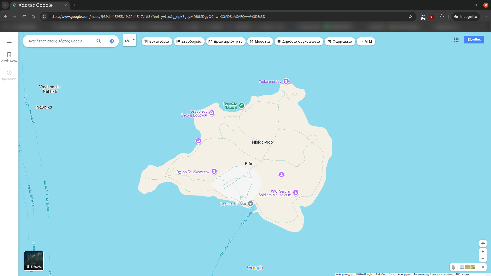
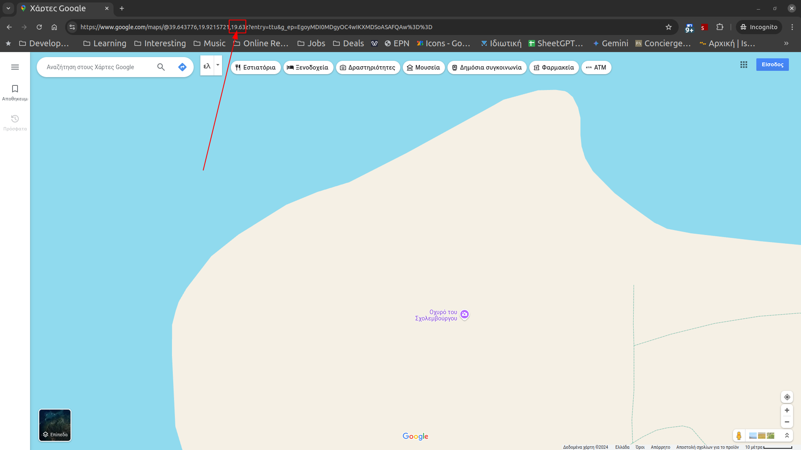
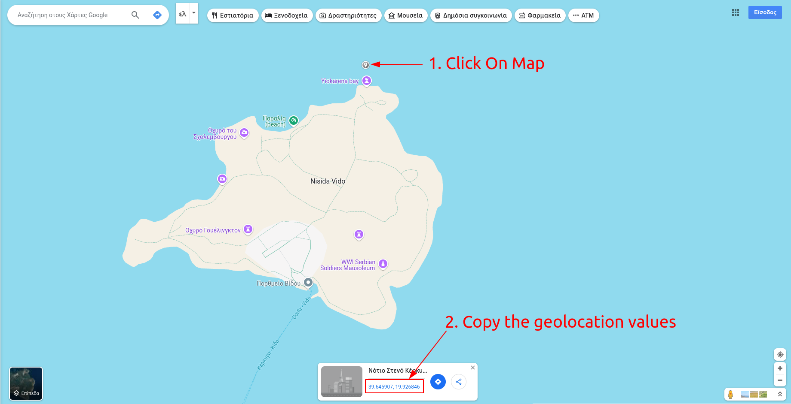
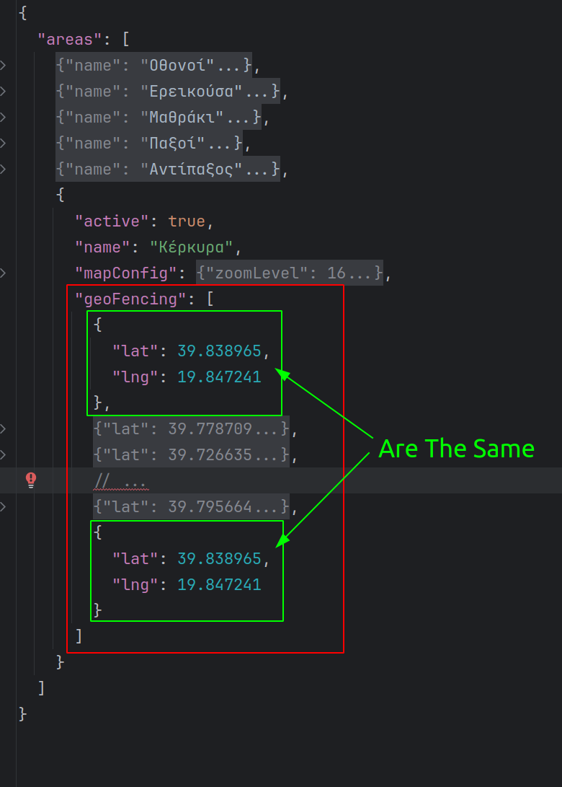
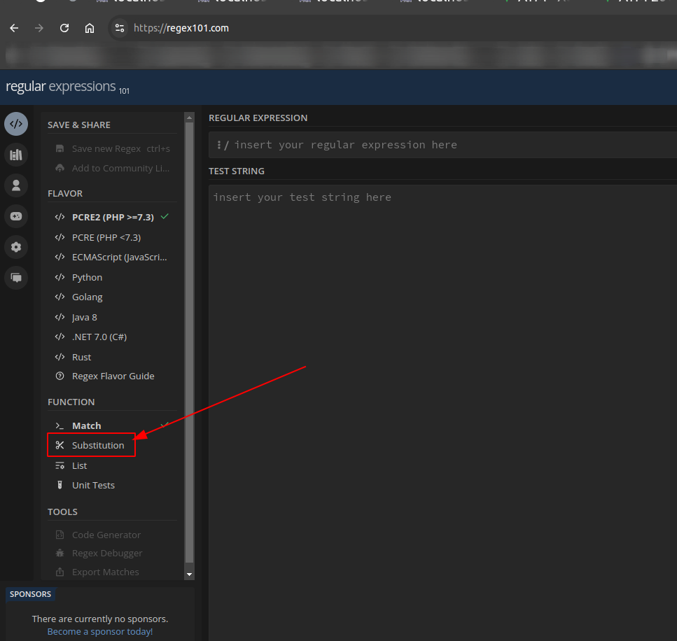
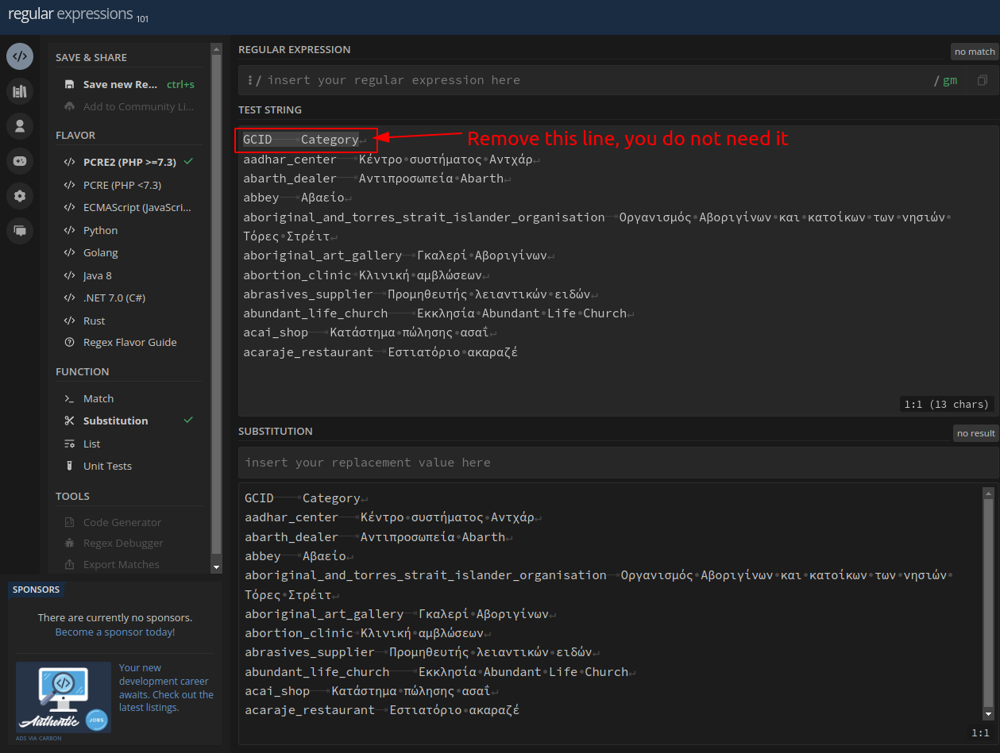
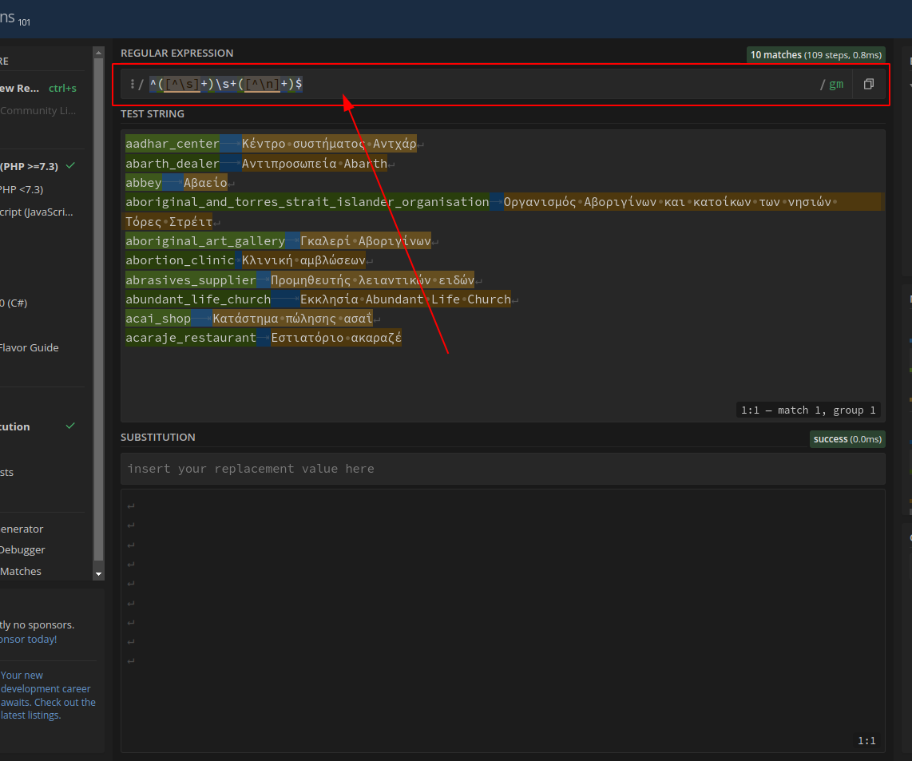
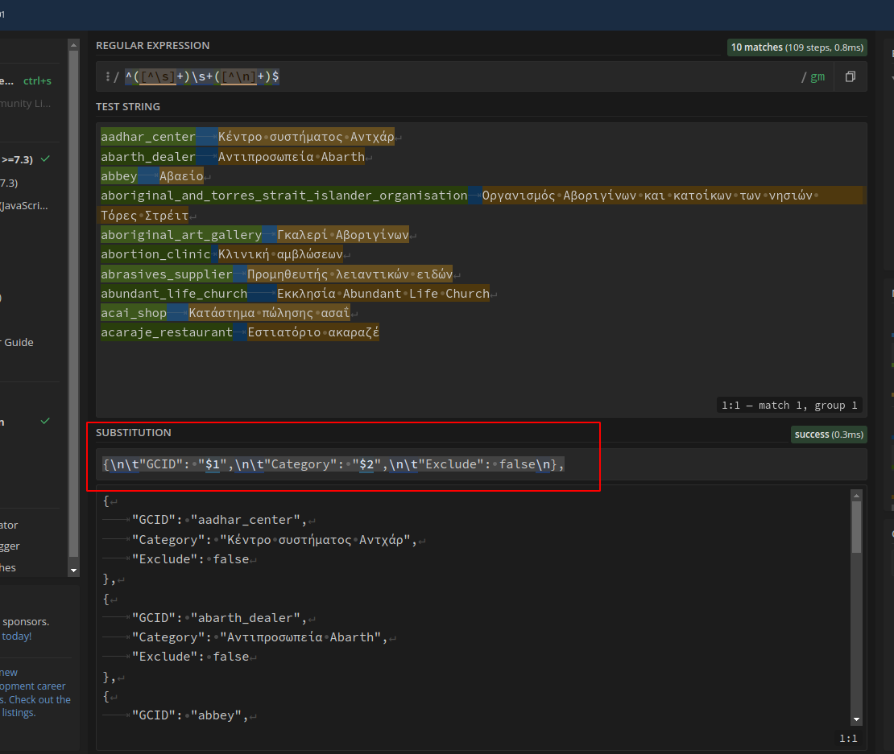
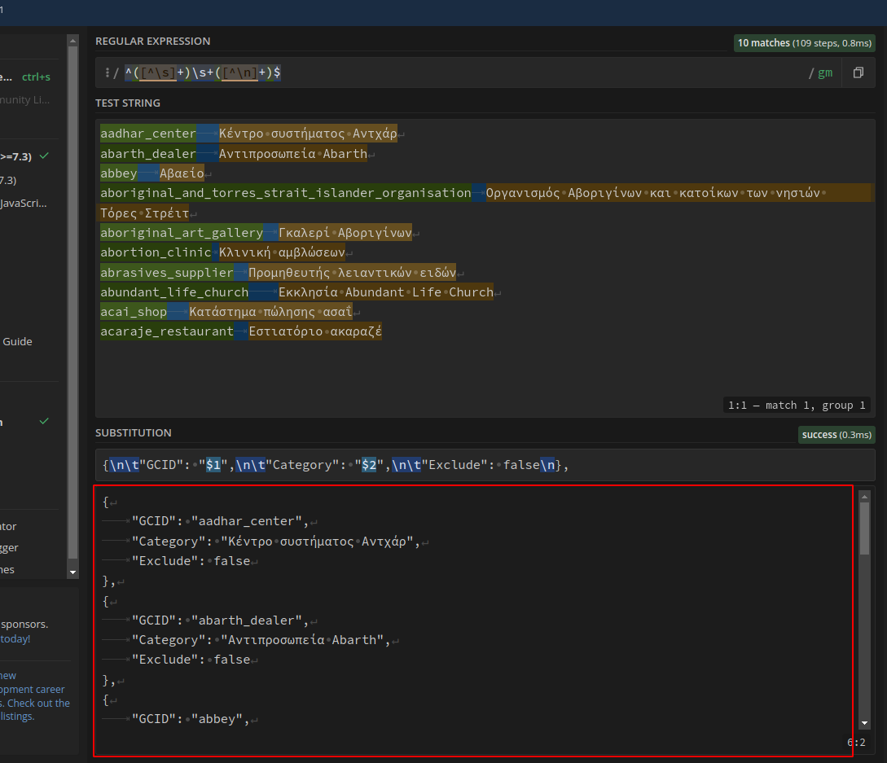
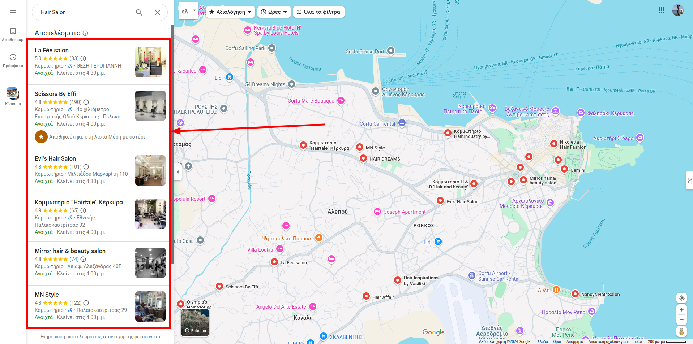

# Google Maps Extractor

**Google Maps Extractor** is a JavaScript application designed to extract and collect data from Google Maps.

This tool allows users to define a specific geographic area by setting boundary coordinates and then select the desired
categories of points of interest (POIs) within that region.

By systematically traversing the specified area, the scraper efficiently gathers detailed information about the
identified POIs, such as their names, locations, and associated attributes.

## Disclaimer

**Please note that this project is intended for educational purposes only. It is not designed to be used for large-scale or commercial data scraping activities.**

**I am not responsible for any misuse of this project. If you choose to use this tool for any purpose other than educational, you do so at your own risk and agree to comply with all applicable laws and regulations.**

**By using this project, you acknowledge and agree that:**

- **You will not use this project to scrape data from websites or services that prohibit or restrict scraping.**
- **You will not use this project to collect or distribute personally identifiable information.**
- **You will not use this project for any illegal or unethical purposes.**

**If you have any questions or concerns, please feel free to contact me.**

## Contributors

This project is a pet project I run, and as I am not a Puppeteer expert I am looking for contributors to work along with me on this project to achieve some more complicated operations and/or improve the overall project.

Some of the features I like to implement area the following:

- Make the scrapper operate with prevent images downloaded from Google Maps _(the intent is to reduce the used bandwidth and speed up the scraping)_
- Make the scrapper operate with PROXY but using configurations from the .env file.
- Improve the overall project scraping speed and possibly reduce the memory footprint of the user browser _(I've tried to use FireFox but no luck. The project never started)_ 

## Dependencies

### Project Dependencies

To run this project, you will need the following dependencies installed:

- Docker or a MySQL Server.
- [Bun](https://bun.sh/) JavaScript runtime.

Note: These dependencies can be installed on most modern operating systems. Please refer to the official documentation
for Docker, MySQL, and Bun for specific installation instructions.

### Dependencies installation

```bash
bun install
```

### Database

For the database you should run either the provided `docker-compose.yaml` or run a MySQL Server your self and provide
it's credentials and database name in the `.env` file of the project.

_(Project contains a `.env.example` file. Rename it to `.env` and provide the MySQL information to the new file)_.

### Docker

If you decide to run the project using the `docker-compose-yaml` of the project, you should run in the root directory of
this project the following command:

```bash
docker-compose up
```

## Operations

### Database Preparation

```bash
bun run loadURL
```

### Places URL Scrapper

```bash
bun run placesURLS
```

## Configuration

This project is designed to scrap data from pre-defined geo-fenced areas. To achieve that, the project comes with
an `appconfig.js` file, that is letting the end user to define the maps area that needs to be scanned.

The JSON structure is as following:

```json
{
  "areas": [
    {
      "active": true,
      "name": "Corfu",
      "mapConfig": {
        "zoomLevel": 16,
        "divideLng": 9,
        "divideLat": 32
      },
      "geoFencing": [
        {
          "lat": 39.838965,
          "lng": 19.847241
        },
        {
          "lat": 39.778709,
          "lng": 19.972972
        },
        // ...
        {
          "lat": 39.838965,
          "lng": 19.847241
        }
      ]
    }
  ]
}
```

<a name="config_explanation"></a>

### Config Explanation

- **areas**: An array with all the configuration objects of the areas to be scrapped.
  - **active**: A Boolean value indicating if you want the given area to scrapped.
  - **name**: The name of the area for distinction purposes.
  - **mapConfig**: Configurations for the map scrapping process.
    - **zoomLevel**: At what zoom level the map should be scrapped
    - **divideLng**: How many times should geo-fenced area scrolled to the right to cover the whole scrapped area.
    - **divideLat**: How many times should geo-fenced area scrolled to the bottom to cover the whole scrapped area.
  - **geoFencing**: An array of Lat/Lng objects representing points around the area that should be scrapped.

### areas

An array of areas configurations. In a single project you can have multiple areas that you want to scrap.

### active

This is a boolean value indicating if you want the scrapper to process the given area. Set the value to `false` if you
don't want the scrapper to process the given area.

### name

Is used to distinct what area is currently processed. This value can be anything you like.

### mapConfig

Here you will find information on how I setup the mapConfig.

Let's suppose I want to scrap the following are on the map:



To fetch as many places as possible, I zoom in in a reasonable zoom level and I set the `mapConfig.zoomLevel` to this
value.

For my example, a reasonable zoom level is a `19.63`.



Now, keeping this zoom level active, I manually scroll from left to right until I cover the whole area of the island and
I count the times I scrolled from Left to Right in order to set the number value to the `mapConfig.divideLng`.

https://github.com/user-attachments/assets/1f8fa742-5d21-47f8-b783-782afbcda646

From the example video, I found with that a given zoom level for the given island I should scroll from left to right `2`
times. Then, `2` is the value I set to the `mapConfig.divideLng`.

Finally, I repeat the same steps from Top to Bottom by counting how many times I had to scroll to cover the hole area of
the island in a given zoom level to go from top to bottom.

### geoFencing

For the `geoFencing` configuration the operations I do are the following.

I open the Google Map, and start clicking on the map _(in areas that aren't a google maps place)_, and then copy the
geolocation values in a lat/lng object.

For the given example I do the following:

.

Once I copy the values, inside the `geoFencing` array I create an object that has the following structure:

```json
{
  "lat": 39.645907,
  "lng": 19.926846
}
```

Then, I repeat this process until I have all the points around the area I am interested to scrap.

***Note**: The most accurate/detailed the geo-fencing data are, the most clear data you will have at the end. For the
current example, that is an island, the geo fencing points can be more abstract as there's nothing close enough to
extract places from it. But for areas that you don't like to mix places from areas close to the geo-fencing area, you
should be more detailed on geo-location data you choose.*

Finally, to make the geo-fenced area a closed fence, you should copy the first item of the `geoFencing` array to the end
to have the same geo-location data on start and end.

.

## Categories

To get a list of Google Places Categories you can visit
the [PlePer.com](https://pleper.com/index.php?do=tools&sdo=gmb_categories).

At the end of this page there's a form, that you can choose language and country. The form also has a "Show results in
table" that you should **not check**. Submit the form and after few seconds, you will redirected in a new page that in
the bottom will have a text area with records like the following:

```text
GCID	Category
aadhar_center	Κέντρο συστήματος Αντχάρ
abarth_dealer	Αντιπροσωπεία Abarth
abbey	Αβαείο
aboriginal_and_torres_strait_islander_organisation	Οργανισμός Αβοριγίνων και κατοίκων των νησιών Τόρες Στρέιτ
aboriginal_art_gallery	Γκαλερί Αβοριγίνων
abortion_clinic	Κλινική αμβλώσεων
abrasives_supplier	Προμηθευτής λειαντικών ειδών
abundant_life_church	Εκκλησία Abundant Life Church
acai_shop	Κατάστημα πώλησης ασαΐ
acaraje_restaurant	Εστιατόριο ακαραζέ
// ...
```

Copy the text from this text area, and then go to the [regex101](https://regex101.com/) to convert this text into a JSON
by doing the following:

1. From the options in the right, choose the "Substitution":
   .
2. In `TEST STRING` paste the categories you copied from the textarea field in the PlePer.com and delete the first line
   that is `GCID	Category`: .
3. In the field `REGULAR EXPRESSION` use this regular
   expression: `^([^\s]+)\s+([^\n]+)$`: .
4. In the field `SUBSTITUTION` end the following
   text `{\n\t"GCID": "$1",\n\t"Category": "$2",\n\t"Exclude": false\n},`: .
5. Copy the JSON from the `SUBSTITUTION` text
   area: .
6. Open the project file `categories.json` and delete everything.
7. Inside the `categories.json` add the text `[]` and between the brackets paste the `JSON` you copied from
   the `regex101` website.

***NOTE**: To make the JSON valid, scroll to the end of the `categories.json`, and if before the closing bracket `]` you
have a comma, then remove the last comma.*

*For example, if your categories.json ends like that :*

```json
[
  {
    "GCID": "aadhar_center",
    "Category": "Κέντρο συστήματος Αντχάρ",
    "Exclude": false
  },
  {
    "GCID": "abarth_dealer",
    "Category": "Αντιπροσωπεία Abarth",
    "Exclude": false
  },
  // ... other records
  {
    "GCID": "acaraje_restaurant",
    "Category": "Εστιατόριο ακαραζέ",
    "Exclude": false
  }
]
```

*then you have to remove the comma, right before the `]` like that:*

```json
[
  {
    "GCID": "aadhar_center",
    "Category": "Κέντρο συστήματος Αντχάρ",
    "Exclude": false
  },
  {
    "GCID": "abarth_dealer",
    "Category": "Αντιπροσωπεία Abarth",
    "Exclude": false
  },
  // ... other records
  {
    "GCID": "acaraje_restaurant",
    "Category": "Εστιατόριο ακαραζέ",
    "Exclude": false
  }
]
```

## Workflow

This scrapper workflow operates like that:

1. Load the Category URLs in the DB.
2. Fetch the places for each generated Category URL from the step #1.
3. [WIP] Fetch each place data.

### Load Category URLs in the DB.

This step will populate the database with Google Maps URLs for each category that isn't `Excluded`.

The process is working like that:

1. The app will calculate how long should be the `lat` and `lng` step to scrap each area of the geo-fenced terrain. The
   calculation is based on the provided geo-fenced data and the `divideLng` and `divideLat` values provided in the
   configuration.
2. Then the app will iterate over the categories that aren't excluded from the `categories.json` file.
3. Once we have the `lat`/`lng` step length and the categories, the app will generate and save in the DB the categories
   URLs that looks like
   this: `https://www.google.com/maps/search/${cat}/@${tile.lat},${tile.lng},${area.mapConfig.zoomLevel}z?entry=ttu`.

### Fetch the places for each generated Category URL from the step #1.

This process is responsible to visit each of the URLs generated from the previous step, and extract the places found for
a given category and geolocation data as URLs and save them in a new database place that holds all the found places that
will be scrapped in the 3rd step of the workflow.

The places URL's are from the items found in the Search Results in the sidebar, like that:



### [WIP] Fetch each place data.

Finally, this step, is responsible to extract as much information as possible for each found place. 
